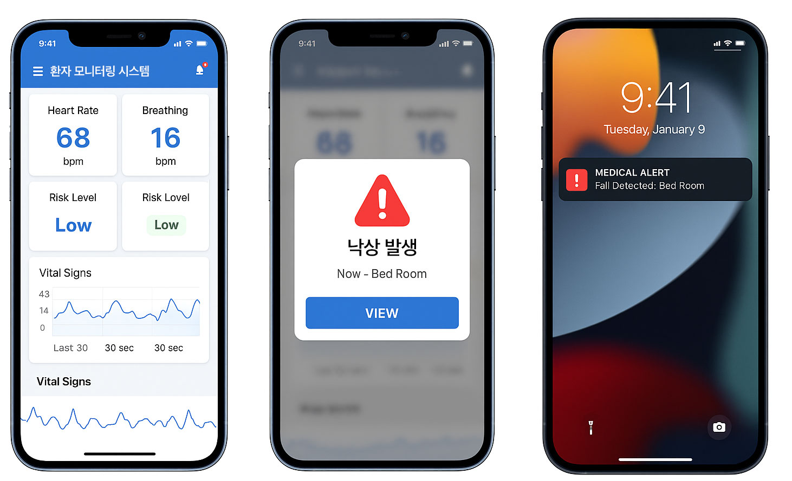

# 독거노인 안전 돌봄 모니터링 앱



## 개요

KAIST 김재철AI대학원 CAIO 9기 11조에서 개발한 **독거노인 안전 돌봄을 위한 스마트 감지 AI 시스템**의 의료진용 모니터링 앱입니다.

60GHz mmWave 센서로 측정된 심박수, 호흡수, 낙상 감지 데이터를 실시간으로 모니터링하고, 위험 상황 발생 시 즉시 Push Notification을 통해 의료진에게 알립니다.

## 주요 기능

### 실시간 모니터링
- **Heart Rate (심박수)**: 60-100 bpm 정상 범위 표시
- **Breathing Rate (호흡수)**: 12-20 bpm 정상 범위 표시
- **Risk Level**: Low / Medium / High 위험도 표시
- **Vital Signs Chart**: 최근 30초간 심박/호흡 추이 그래프

### 낙상 감지 알림
- **FALL_DETECTED**: 낙상 감지됨
- **FALL_CONFIRMED**: 낙상 확정 (2초 이상 지속)
- **FALL_CRITICAL**: 위급 상황 (30초 이상 움직임 없음)
- **RECOVERED**: 회복됨

### Push Notification
- Firebase Cloud Messaging (FCM) 기반 푸시 알림
- 백그라운드 및 앱 종료 상태에서도 알림 수신
- 알림 클릭 시 앱 내 상세 화면으로 이동

## 기술 스택

| 구분 | 기술 |
|------|------|
| Framework | Flutter 3.x |
| State Management | Provider |
| Push Notification | Firebase Cloud Messaging |
| Local Notification | flutter_local_notifications |
| MQTT Client | mqtt_client |
| Charts | fl_chart |

## 시스템 아키텍처

```
┌─────────────────┐     ┌──────────────┐     ┌───────────────┐
│  mmWave Sensor  │────▶│ MQTT Broker  │────▶│  Flutter App  │
│  (MR60BHA2)     │     │ (Mosquitto)  │     │               │
└─────────────────┘     └──────────────┘     └───────┬───────┘
                                                     │
                                                     ▼
                                             ┌───────────────┐
                                             │   Firebase    │
                                             │     FCM       │
                                             └───────┬───────┘
                                                     │
                                                     ▼
                                             ┌───────────────┐
                                             │ Push Notify   │
                                             └───────────────┘
```

## 설치 및 설정

### 1. 사전 요구사항

- Flutter SDK 3.7.0 이상
- Dart SDK 3.0.0 이상
- Android Studio / Xcode
- Firebase 프로젝트

### 2. 프로젝트 클론

```bash
cd elderly_care_app
flutter pub get
```

### 3. Firebase 설정

#### Android

1. [Firebase Console](https://console.firebase.google.com/)에서 Android 앱 추가
2. 패키지명: `com.kaist.caio.elderly_care_app`
3. `google-services.json` 다운로드
4. `android/app/google-services.json`에 저장

```bash
# 예시 파일 참조
cp android/app/google-services.json.example android/app/google-services.json
# 다운로드 받은 파일로 교체
```

#### iOS

1. Firebase Console에서 iOS 앱 추가
2. Bundle ID: `com.kaist.caio.elderlyCareApp`
3. `GoogleService-Info.plist` 다운로드
4. `ios/Runner/GoogleService-Info.plist`에 저장

```bash
# 예시 파일 참조
cp ios/Runner/GoogleService-Info.plist.example ios/Runner/GoogleService-Info.plist
# 다운로드 받은 파일로 교체
```

### 4. MQTT 브로커 설정

`lib/main.dart`에서 MQTT 브로커 주소 수정:

```dart
final mqttService = MqttService(
  broker: 'YOUR_MQTT_BROKER_IP',  // 실제 브로커 주소
  port: 1883,                      // MQTT 포트
);
```

### 5. 앱 실행

```bash
# 개발 모드
flutter run

# Release 빌드 (Android)
flutter build apk --release

# Release 빌드 (iOS)
flutter build ios --release
```

## MQTT 토픽 구조

### Vital Signs (`mm/j`)

```json
{
  "hr": 68,           // Heart Rate (bpm)
  "br": 16,           // Breath Rate (bpm)
  "d": 80.4,          // Distance (cm)
  "timestamp": 1702234567
}
```

### Fall Status (`fall/status`)

```json
{
  "gw": "lab1",       // Gateway ID
  "id": "f01",        // Sensor ID
  "fall": 1,          // 0: 정상, 1: 낙상
  "human": 1,         // 0: 부재, 1: 재실
  "type": "FALL_CONFIRMED",
  "duration": 5,      // 지속 시간 (초)
  "timestamp": 1702234567
}
```

### Fall Alert (`fall/alert`)

```json
{
  "gw": "lab1",
  "id": "f01",
  "type": "FALL_CRITICAL",
  "duration": 35,
  "timestamp": 1702234567
}
```

## 프로젝트 구조

```
lib/
├── main.dart                 # 앱 진입점
├── models/
│   └── vital_data.dart       # 데이터 모델 (VitalData, FallData)
├── services/
│   ├── mqtt_service.dart     # MQTT 연결 및 메시지 처리
│   └── notification_service.dart  # FCM 및 로컬 알림
├── providers/
│   └── monitoring_provider.dart   # 상태 관리
├── screens/
│   └── home_screen.dart      # 메인 화면
└── widgets/
    ├── vital_card.dart       # Vital Sign 카드
    ├── vital_chart.dart      # 시계열 차트
    └── fall_alert_dialog.dart # 낙상 알림 다이얼로그
```

## 위험도 판단 기준

### 심박수 (Heart Rate)

| 범위 | 상태 |
|------|------|
| < 40 bpm | Critical |
| 40-59 bpm | Warning |
| 60-100 bpm | Normal |
| 101-120 bpm | Warning |
| > 120 bpm | Critical |

### 호흡수 (Breath Rate)

| 범위 | 상태 |
|------|------|
| < 8 bpm | Critical |
| 8-11 bpm | Warning |
| 12-20 bpm | Normal |
| 21-25 bpm | Warning |
| > 25 bpm | Critical |

## 알림 우선순위

| 유형 | 설명 | 알림 수준 |
|------|------|----------|
| FALL_CRITICAL | 위급 상황 (30초+ 무움직임) | 긴급 알림 + 사운드 |
| FALL_CONFIRMED | 낙상 확정 | 높음 알림 |
| FALL_DETECTED | 낙상 감지 | 일반 알림 |
| RECOVERED | 회복됨 | 정보성 알림 |

## 테스트

MQTT 테스트 서버가 실행 중인 경우:

```bash
# 테스트 서버 (test1/server)
cd ../test1/server
npm install
npm start

# 낙상 테스트 트리거
curl -X POST http://localhost:3132/test/fall
```

## 라이선스

이 프로젝트는 KAIST 김재철AI대학원 CAIO 9기 교육 목적으로 개발되었습니다.

## 참고 자료

- [60GHz mmWave를 사용한 Vital Sign 모니터링 논문](https://dl.acm.org/doi/10.1145/3051124)
- [LangGraph Ambient Agent](https://blog.langchain.com/introducing-ambient-agents/)
- [Firebase Cloud Messaging 문서](https://firebase.google.com/docs/cloud-messaging)
- [Flutter 공식 문서](https://flutter.dev/docs)
